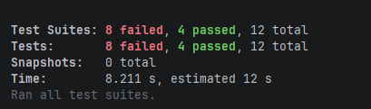
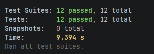
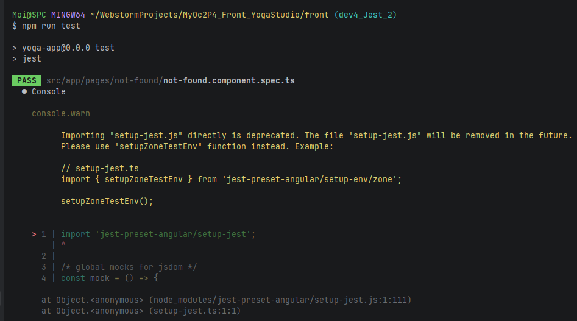
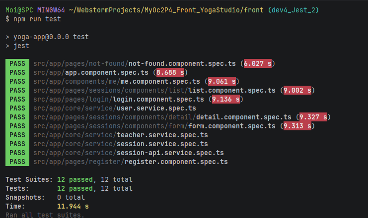
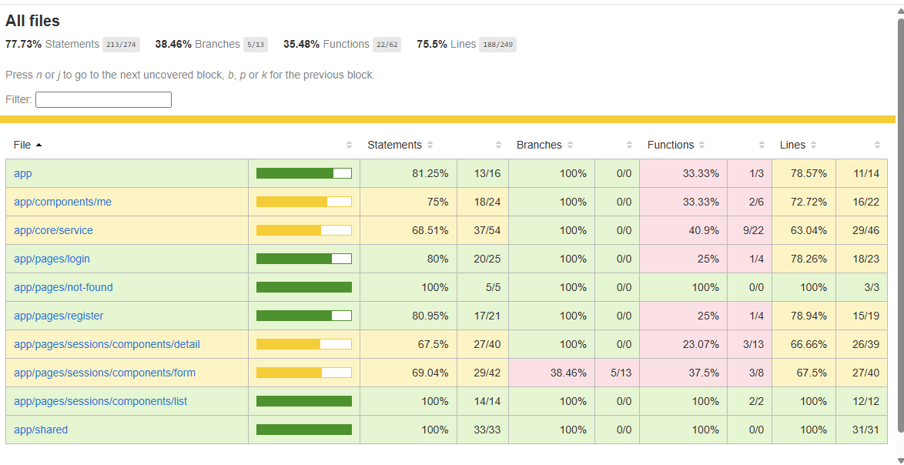
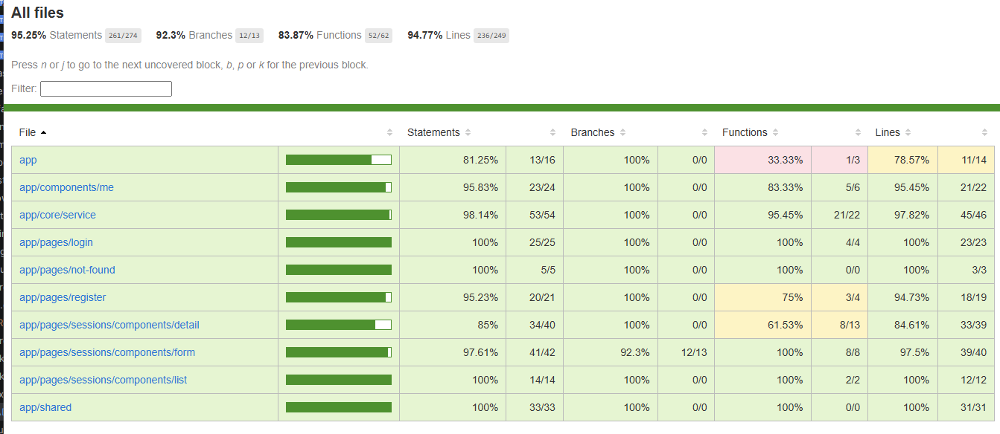
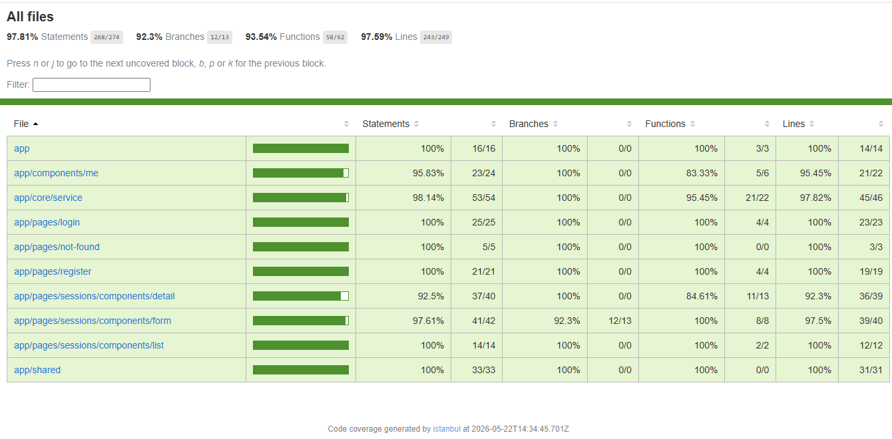
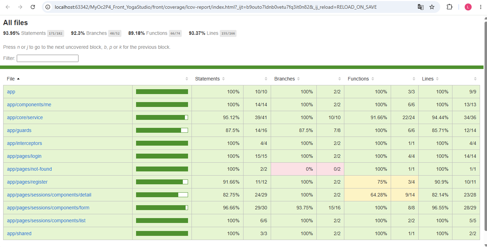

# dev1
- Installation des dépendances Angular :
> npm install

- Démarrage du frontend:
> npm run start;

- Test E2E  
Launching e2e test:
> npm run e2e

Génération du rapport coverage :
> npm run e2e:coverage

- Tests unitaires
> npm run test

for following change:

> npm run test:watch  

# dev2 : 
Les bonnes pratiques telles que :
- le désabonnement des observables (unsubscribe observables) :  
   - Refactor : MeComponent,DetailComponent,FormComponent,LoginComponent et RegisterComponent  
  
- Typer explicitement toutes les méthodes: DetailComponent

# dev3 :
Les bonnes pratiques telles que :  
- Corriger tous les any  
  Refactor : session-api.service.ts, user.service.ts

# dev4 :  
- Suppression des directives structurelles obsolètes *ngIf et *ngFor :  
  Refactor : login.component.html, list.component.html,form.component.html,app.component.html  

# dev4_Jest_1  
Avant correction avec "npm run test" :  
  

Correction :

- list.component.spec.ts :  
il manque : import { provideRouter } from '@angular/router';  
 providers: [{ provide: SessionService, useValue: mockSessionService },provideRouter([])]  

- Le reste des composants :   
supprimer "declarations: [LoginComponent],"    
Ajouter : "imports: [ LoginComponent,...ReactiveFormsModule]"  

refactor :  
modified:   src/app/app.component.spec.ts  
modified:   src/app/components/me/me.component.spec.ts  
modified:   src/app/pages/login/login.component.spec.ts  
modified:   src/app/pages/not-found/not-found.component.spec.ts  
modified:   src/app/pages/register/register.component.spec.ts  
modified:   src/app/pages/sessions/components/detail/detail.component.spec.ts  
modified:   src/app/pages/sessions/components/form/form.component.spec.ts  
modified:   src/app/pages/sessions/components/list/list.component.spec.ts  

Après correction :   
  

# dev4_Jest_2
warning Setup-jest :  
  

Suppression des warning :     
- En remplaçant  "import 'jest-preset-angular/setup-jest';"   
dans setup-jest.ts :  
- Par import { setupZoneTestEnv } from 'jest-preset-angular/setup-env/zone';  
  setupZoneTestEnv();  

# dev4_jest_3
Améliorer le taux de couverture de tests Jest
Taux de couverture de tests avant :  
  

Codes refactorisés ou implémentés :  
- modified:   src/app/components/me/me.component.spec.ts  
- modified:   src/app/core/service/auth.service.spec.ts  
- modified:   src/app/core/service/session-api.service.spec.ts  
- modified:   src/app/core/service/session.service.spec.ts  
- modified:   src/app/core/service/teacher.service.spec.ts  
- modified:   src/app/core/service/user.service.spec.ts  
- modified:   src/app/pages/login/login.component.spec.ts  
- modified:   src/app/pages/register/register.component.spec.ts  
- modified:   src/app/pages/sessions/components/detail/detail.component.spec.ts  
- modified:   src/app/pages/sessions/components/form/form.component.spec.ts  

Tests Jest 95% de couverture :  

# dev4_jest_4
Amélioration la couverture des tests des fonctions :  
  

# dev5_Cypress_1
Desinstallation de cypress :
- $ npm uninstall cypress
- $ npm install cypress --save-dev 
- $ npx cypress open
  => No version of Cypress is installed in:
  C:\Users\Moi\AppData\Local\Cypress\Cache\15.15.0\Cypress
- $ npx cypress install 

# dev5_Cypress_2
Configuration et lancement tests

# dev5_Cypress_3
Couverture "Coverage"
- ng run yoga:serve-coverage (lire dans angular.json)
- npx cypress run
- npm run e2e:coverage

 

# dev5_cypress_4
Amélioration tests coverages :
- main.ts ( statements= 50% Functions:0%)
- me.component.ts ( statements= 64% Functions:50%)
- Exclure main.ts
  Refactor : 8_Account.cy.ts pour le composant me.component.ts
  Implementation : 10_UnGuard.cy.ts
  

# solution_front
- Merge de la branche dev5_cypress_4
- Ajout le fichier README_Front.md pour la descriptions des branches git.
